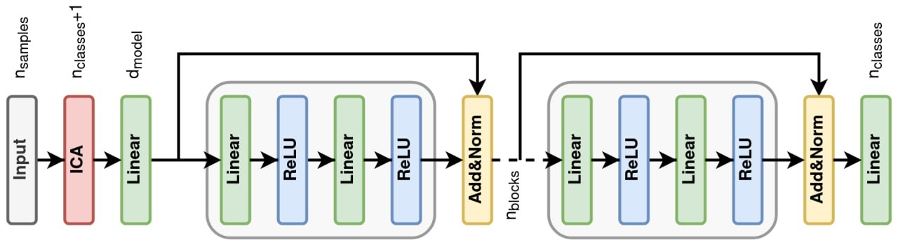
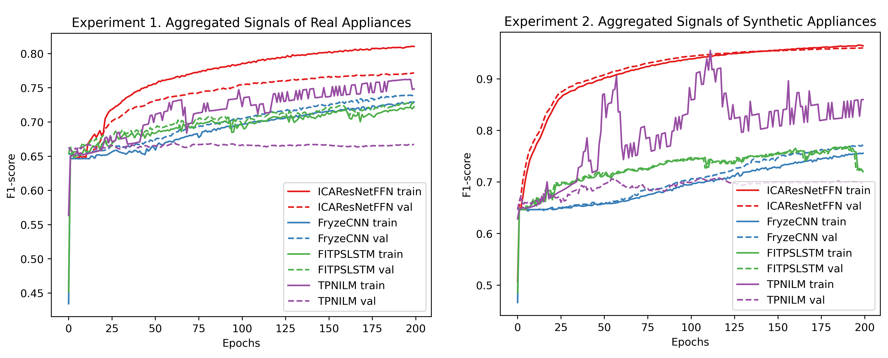
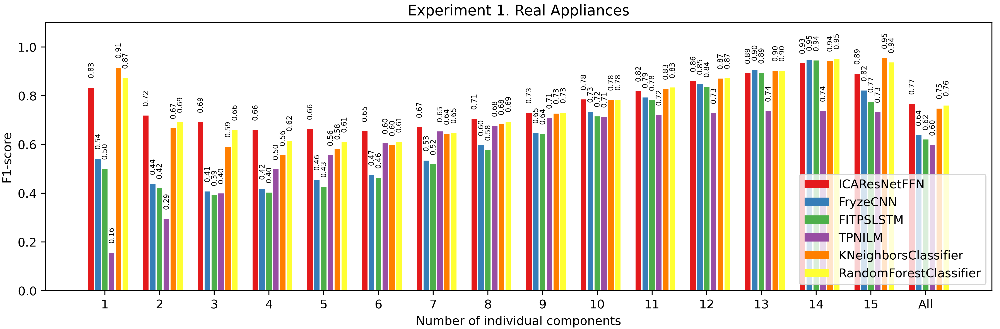
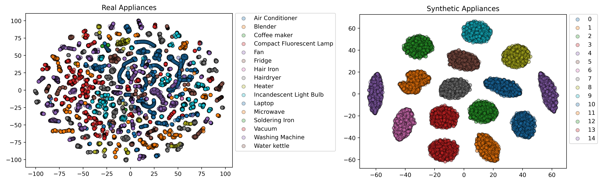

# Energy Disaggregation. A Case Study of Large Number of Components

This repository contains the source code to reproduce experiments on energy disaggregation problem with the use of the Fryze power theory and Convolutional Neural Network. 

In this work, we suggest a novel approach to tackle the problem of energy disaggregation with the use of Non-Intrusive Load Monitoring (NILM). NILM offers an electricity consumption pattern of individual loads at consumer premises, which increases the efficiency of electric consumption for each separate appliance. We develop an algorithm based on the pre-processing with the Fryze power theory alongside with statistical methods and simple Convolutional Neural Network. The model’s performance is one of the best over top-level models in this aread. Concurrently, our approach works well for a numerous simultaneously working appliances, which was a weak spot of all previous models.


<p align="center"></p>


## Presentation and report

The [presentation slides](https://github.com/arx7ti/ML2023SK-final-project/blob/main/presentation/ml_team37_presentation.pdf) and report with all the obtained results and discussion.  


## Environments 

The implementation is GPU-based. Double GPU (GTX RTX 2080 Ti) is enough to train and test the models. All the calculations take approximately 40 minutes.

The list of the packages on which the mode tested is `requirements.txt` file. The most important one are

`torch==1.13.1 torchvision==0.4.1 numpy==1.21.6 timm==0.6.12 scikit-learn=1.1.2`


## Signal separation 

If you want to prepare Plug Load Appliance Identification Dataset (PLAID) dataset data from a scratch, you need to download it from the source [PLAD data](https://figshare.com/articles/dataset/PLAID_-_A_Voltage_and_Current_Measurement_Dataset_for_Plug_Load_Appliance_Identification_in_Households/10084619). Aggregate and sub-metered signals should be saved into `data/aggregated` and `data/submetered`, respectevily. <br />

Another option is to use already prepared data and run the whole jupyter notebook.


## Training and Testing models 

All the training and testing of ICAResNetFFN model and baseline Neural Network models (Temporal Pooling NILM and FIT-PS LSTM), you need to run jupyter notebook `ML2023SK_Team37_final.ipynb`. 


## Baseline classical ML models

To get the scores of baseline classical models for comparison, run the following command 
```
python baseline_classical_ml.py
```


## Results 

All the results are specified in the [report](https;//). Here, we provide the most important ones. First, our model showed the best performance on train and test data compared with other modern algorithms for NILM. Furthermore, the training curve is smoother than for the previous algorithms. Important to note, our architecture of the CNN model is relatively simple compared with some previously suggested Neural Network models. The enhanced performance was achieved with data separation, pre-processing and the addition of synthetic data to the training dataset. 


<p align="center"></p>


Our model has more uniform predictions for each appliance compared with other models. Previously, it was dictated by data imbalance, which our model tackled better.


<p align="center"></p>

The analysis of components showed the components of synthetic data are independents, whereas the real data have dependence. It can be explained by the fact that some appliances can be up to a certain order considered similar to the other. For instance, washing machine simultaneously have heating, rotating parts and their power signal can be similar to other heating and rotating appliances. 

<p align="center"></p>


